## Continous Integration Pipeline For Tooling Website

First Step: Install and Configure Jenkins Server.
1. Create an AWS EC2 instance based on Ubuntu Server 20.04 LTS and name it "Jenkins" and open port TCP:8080, SSH:22 and source 0.0.0.0/0 in the inbound rule of the security group. 

    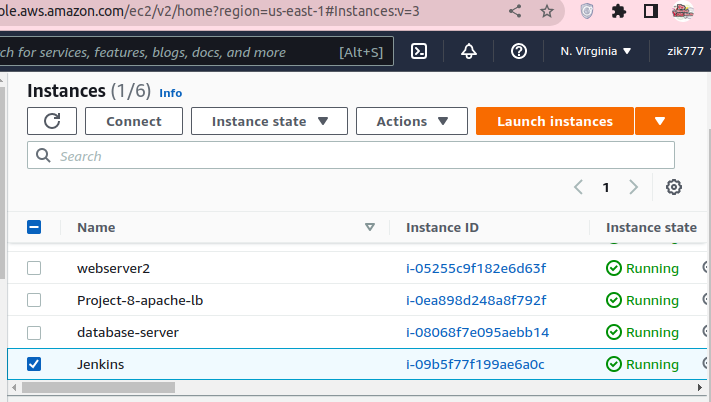
   
    
    

2. Connect to Jenkins server via terminal and Install JDK (since Jenkins is a Java-based application).
   - Run `sudo apt update -y`
   - Run `sudo apt install default-jdk-headless`

     

3. Install Jenkins.
   - Run `wget -q -O - https://pkg.jenkins.io/debian-stable/jenkins.io.key | sudo apt-key add -
sudo sh -c 'echo deb https://pkg.jenkins.io/debian-stable binary/ > \
    /etc/apt/sources.list.d/jenkins.list'
sudo apt update
sudo apt-get install jenkins`

     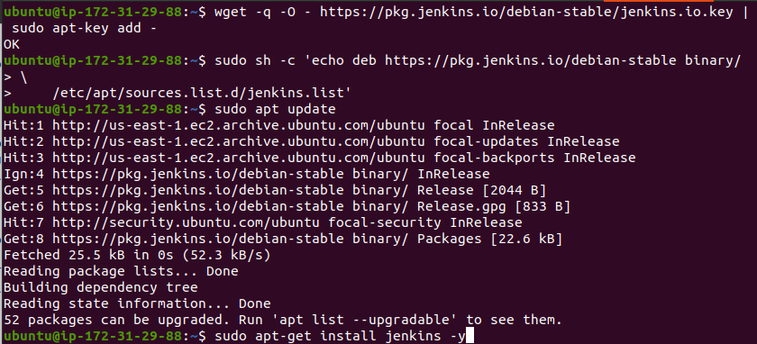.

- Make sure Jenkins is up and running.
   - Run `sudo systemctl status jenkins`

     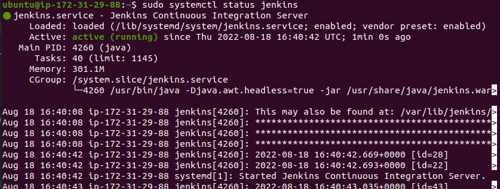
 
4. Perform initial Jenkins setup. From the browser access the Jenkins UI 
   - via http://(Jenkins-Server-Public-IP-Address-or-Public-DNS-Name):8080

     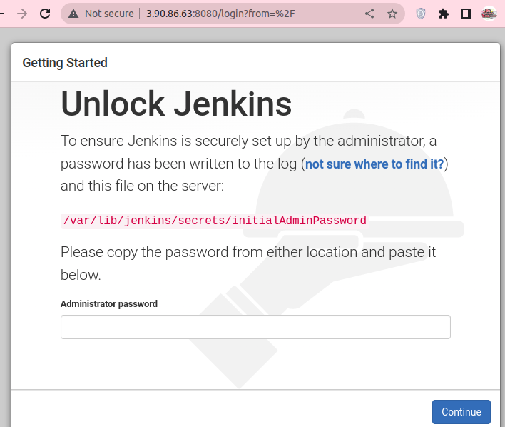

- Unlock Jenkins by retrieving and providing the default admin password. 
  - Retrieve it from your server via the terminal and past it on the browser UI page:
    - Run `sudo cat /var/lib/jenkins/secrets/initialAdminPassword`.

    

- Then install required plugings 
by – choosing the "install suggested plugins." option.

   

- After plugins installation – create an admin user and obtain Jenkins server address and login.

   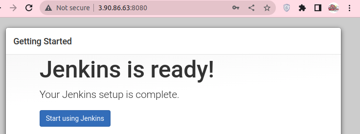
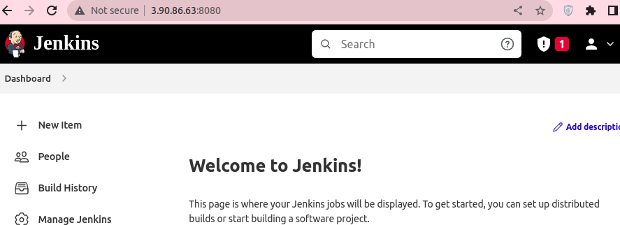

Second Step: Configure Jenkins job/project to retrieve source codes from GitHub using Webhooks.

1. Enable webhooks on the tooling repo in GitHub repository settings.

  

   
- then  add the following url to webhook setting of the forked repo. URL: http://(Jenkins-Server-Public-IP-Address-or-Public-DNS-Name):8080/github-webhook

  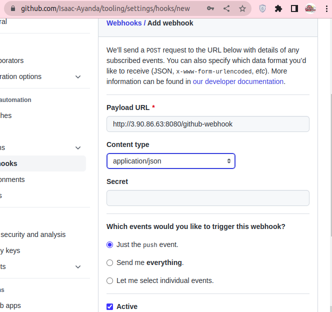. 

  

- Create freestyle project in Jenkins web console:
  - click `"New Item" on the left pan and create a "Freestyle project"`
  - `name: project9, click on free style project then okay.
 

 - In configuration of your Jenkins freestyle project choose Git repository. 
- under source code management: Select Git

- connect personal GitHub repository, by providing the URL to the tooling solution.
then copy and past it into the "Repository URL" then "Add Credentials" and save.

- Add `credentials of gitub.username and password then click add~ select the 
created credential and save the configuration.

- Click on the Build link and check Console output to see if the build is successfully.

    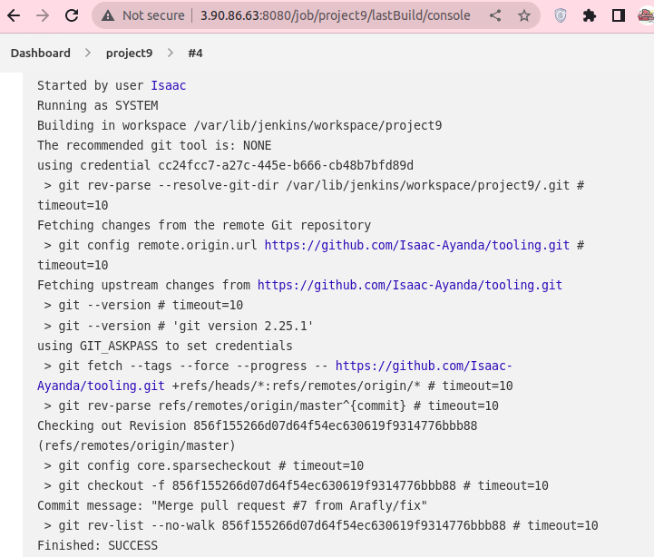

3. Click "Configure" your job/project and add these two configurations:
- `Configure triggering the job from GitHub webhook:

- Under build environment,configure "Post-build Actions" to Archive the artifacts then files to archive: add ** then click save

   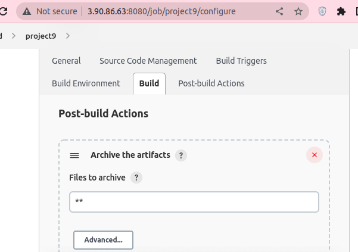

- To check if the configuration works successfully by editing the readme.md file and adding a line at the ending then commit changes.
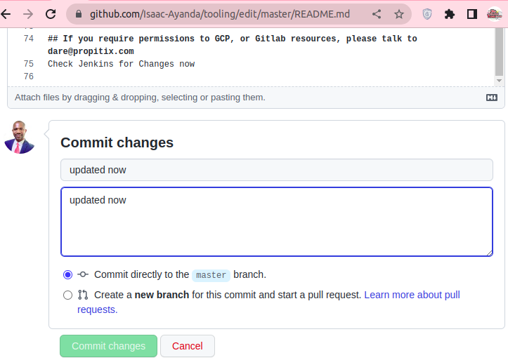

The fifth build is triggered by the recent push event. A new build has been launched automatically (by webhook) – artifacts, saved on Jenkins server. status>view artifacts!

   

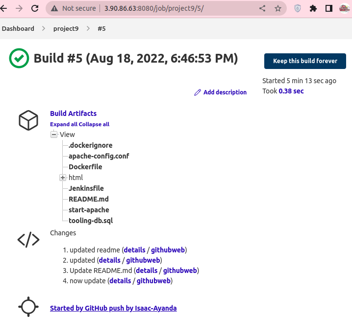
- By default, the artifacts are stored on Jenkins server locally.
   ls /var/lib/jenkins/jobs/tooling_github/builds/<build_number>/archive/

   
     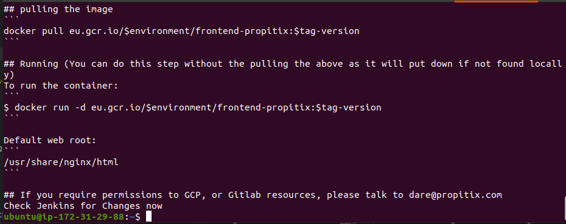

Second Step: Configure Jenkins To Copy Files To NFS Server VIA SSH

1. Copy artifacts from Jenkins server to /mnt/apps directory on NFS server.
- Install "Publish Over SSH" plugin, to Configure Jenkins to copy files to NFS server via SSH. On "Available" tab search for "Publish Over SSH" plugin and install it by ticking the box and hit install without restart.

   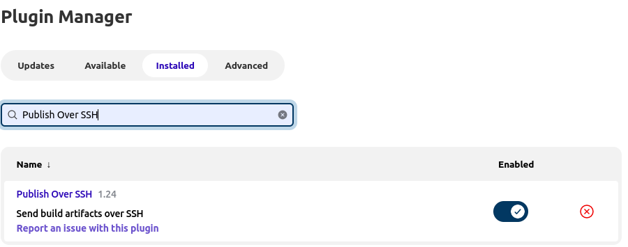
   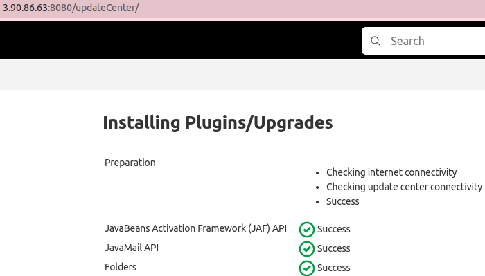

2. Configure the job/project to copy artifacts over to NFS server.
   - On main dashboard select "Manage Jenkins" and choose "Configure System" menu item.
   - Scroll down to "Publish over SSH" plugin configuration section and configure it to be able to connect to your NFS server.

     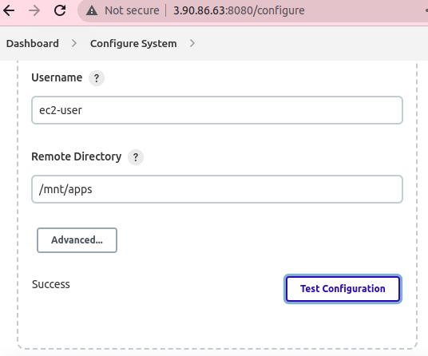.
  
- Provide the content of private key (content of .pem file that you use to connect to NFS 
server via SSH/Putty). Test the configuration and make sure the connection returns Success.

   

- To copy files to NFS server, open your Jenkins job/project configuration page and add 
another one "Post-build Action", select Send buld artifacts over SSH and in the source file option add ** then save.

 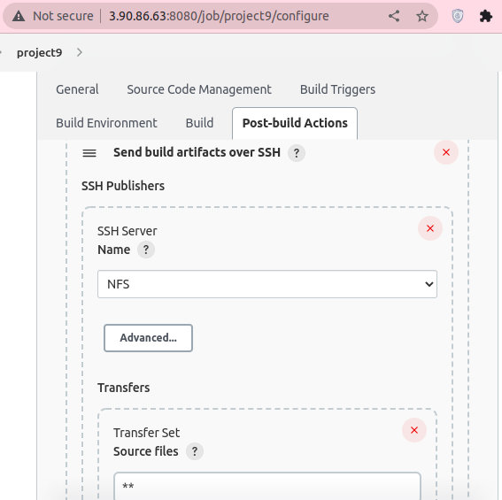

- Check permission of /mnt/apps and change its permission on the NFS server
sudo chmod 777 /mnt/apps
sudo chmod -R 777 /mnt
sudo chown nobody:nobody /mnt/apps
sudo chown -R nobody:nobody /mnt

 .

-  Then make changes in README.MD file in your GitHub. Like deleting the comment on line 75 earlier added to the README.md file of the Tooling repository then commit changes.

 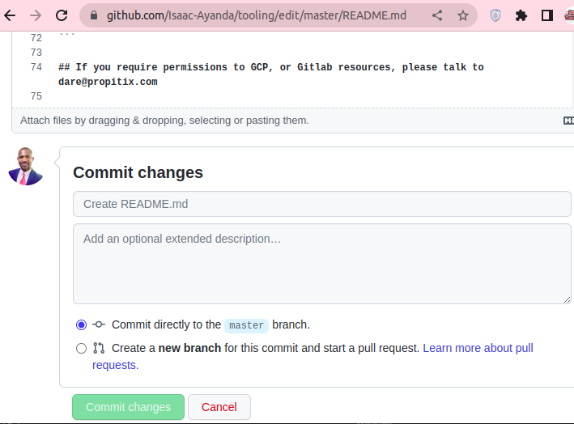

- Webhook will trigger the new #6 new job and in the "Console Output" of the job you will find something like this:
 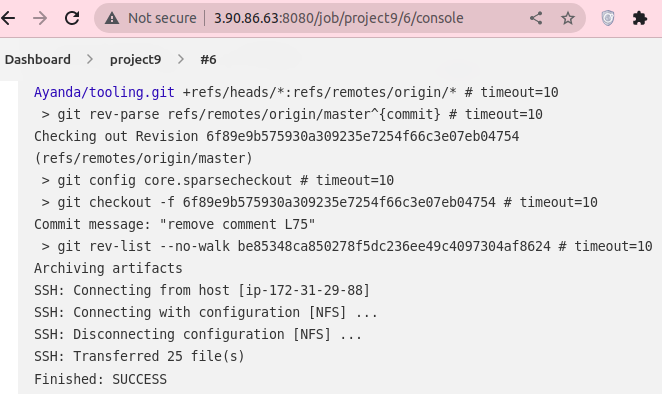

- To make sure that the files in /mnt/apps have been udated – connect via SSH/Putty to your NFS server and check README.MD file.

 

- Check the content of the artifacts just collected on the NFS server:
cd /mnt/apps
ll
then cat /mnt/apps/README.md
If you see the changes you had previously made in your GitHub – the job works as expected.

 

 
